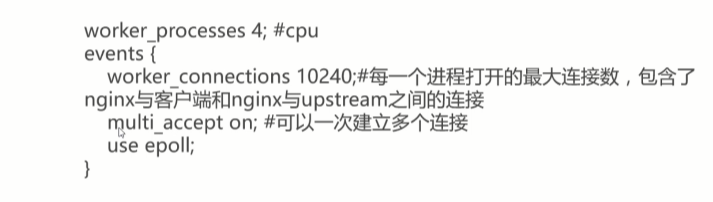

java 生产问题


# 1.JVM参数


# 2. JVM 参数使用；

**参考**

https://docs.oracle.com/javase/1.5.0/docs/tooldocs/

## 2.1   查看最终使用参数

```shell
java -XX:+PrintFlagsFinal -version;

```


具体参考

problem-on-line-result/printFlagsFinal.txt

**可供诊断信息**

是否使用G1回收器


初始化堆大小


## 2.2 jps


```
The program 'jps' can be found in the following packages:
// 没有设置环境变量；


# 修改/etc/profile文件
sudo vim /etc/profile
# 追加信息
export JAVA_HOME=/opt/java/jdk1.8.0_231
export PATH=${JAVA_HOME}/bin:${PATH}


// 然后 source 保存

source /etc/profile

```


## 2.3 jinfo


## 2.4 jstat

### 2.4.1  查看类装载信息

```
jstat -class 
```


### 2.4.2  垃圾收集

```
jstat -gc ,-gcutil,-gccause,-gcnew,-gcold

jstat -gc 1000 10 // 1s一次，发10次；
```


- S0c,S1C,SOU,S1U:S0和S1的总量和使用量

- EC,EU:Eden 区总量与使用量

- OC,OU ：Old 区总量与使用量

- MC,MU :Metaspace 区总量与使用量（1.6没有，1.8）

- CCSC,CCSU :压缩类空间总量与使用量

- YGC,YGCT :YoungGC 的次数和时间

- FGC ,FGCT :FullGC的次数与时间

- GCT: 总的GC时间

  

  


### 2.4.3 JIT编译 -compiler,-printcompilation


### 2.4.4 jmap+MAT 实战内存溢出


### 2.4.5 jmap 命令

```
option : -heap,-clstats,-dump:<dump-options> -F
```


### 2.4.6 mat 


### 2.4.7 jstack  

**查询到进程**


**jstack 进程id**

```
 jstack 18769 -H

```


# 3. 可视化工具

## 3.1 jvisuml


## 3.2btrace

   **监控请求参数数据**


```
	@OnMethod(
	        clazz="com.imooc.monitor_tuning.chapter4.Ch4Controller",
	        method="arg2",
	        location=@Location(Kind.ENTRY)
	)
```


```
@OnMethod(
        clazz="com.imooc.monitor_tuning.chapter4.Ch4Controller",
        method="arg1",
        location=@Location(Kind.ENTRY)
)
```


```
@OnMethod(
        clazz="com.imooc.monitor_tuning.chapter2.User",
        method="<init>"
)
```


```
@OnMethod(
    clazz="java.lang.Throwable",
    method="<init>",
    location=@Location(Kind.RETURN)
)
public static void onthrowreturn() {
    if (currentException != null) {
       BTraceUtils.Threads.jstack(currentException);
       BTraceUtils.println("=====================");
        currentException = null;
    }
}
```


# 4. tomcat 调优

## 4.1 tomcat-manage

1. JPDA
2. 


# 5. nginx 性能调优

## 5.1 ngx_http_stub_status 监控连接信息

```
location = /nginx_status{
# stub_status 打开；
stub_status on;
# 关闭日志
access_log off; 
# 允许本机
allow 127.0.0.1;
# 关闭所有
deny all;
}
```


查看所有的编译参数

```
nginx -V  查看编译参数，看ngx_http_stub_status  是不是已经被编译进去

wget http://127.0.0.1/nginx_status
```


## 5.2 ngxtop 监控请求信息

### 5.2.1  安装python-pip


yum install epel-release

yum install python-pip

### 5.2.2 安装ngxtop

pip install  ngxtop


### 5.2.3  ngxtop 使用

- 指定配置文件

  ```shell
  ngxtop -c /etc/nginx/nginx.conf
  ```

  

  查询状态是200

```shell
ngxtop -c /ect/nginx/nginx.conf -i 'status ==200'
```

- 查询访问最多的ip

  ```
  ngxtop -c /etc/nginx/nginx.conf -g remote_addr
  ```

  

## 5.3  nginx-rrd 图形化监控

连接信息，请求信息


## 5.4 nginx 优化

### 5.4.1  增加工作线程数和并发连接数



```
worker_processes 4:#cpu
events{
	worker_connections 10240 ;# 每一个进程打开的最大连接数，包含了nginx与客户端和nginx与	 upstream之间的连接
	multi_accept on :#可以一次建立多个连接
	use epoll;
}
```


### 5.4.2 启用长连接

​	 nginx 和server_pool 保持300个长连接


### 5.4.3 启用缓存压缩


### 5.4.4 操作系统优化


# 6.JVM 调优

## 6.1 JVM内存结构

- 程序计数器 PC Register
- 虚拟机栈 JVM Stacks
- 堆Heap
- 方法区 Method Area
  -  常量池  Run -Time Constant Pool